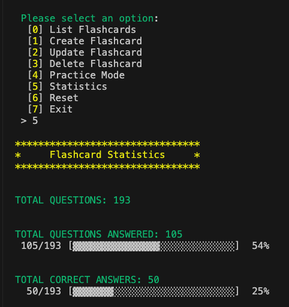
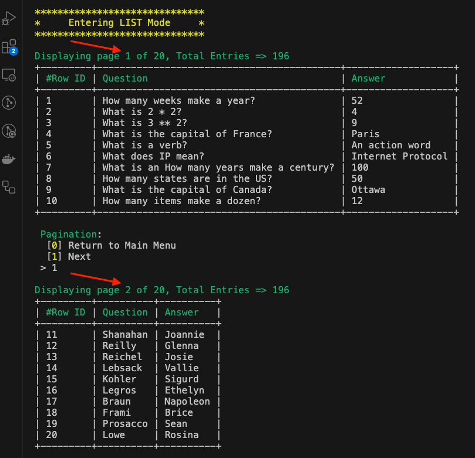
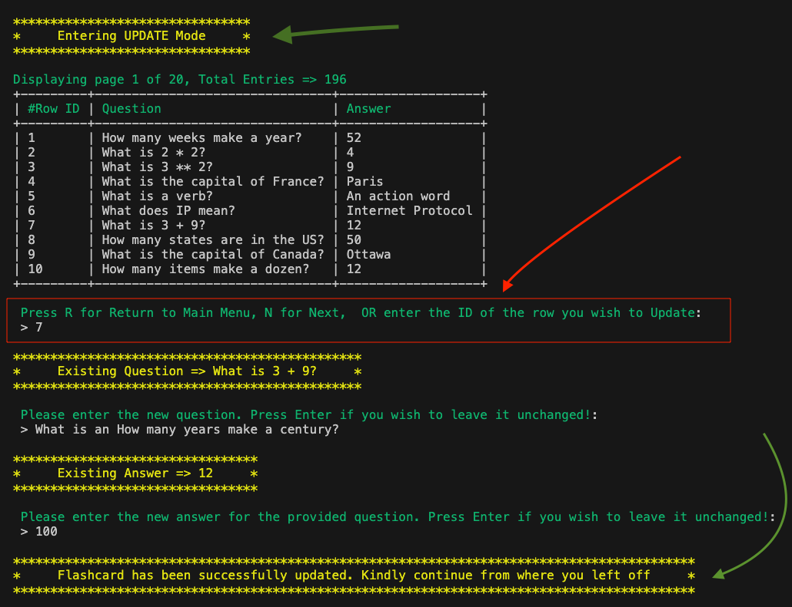
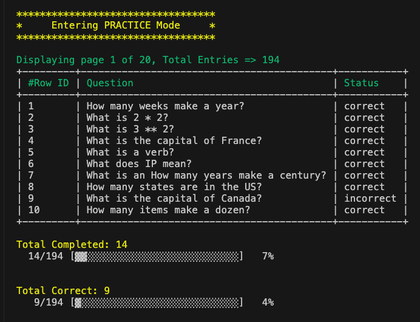
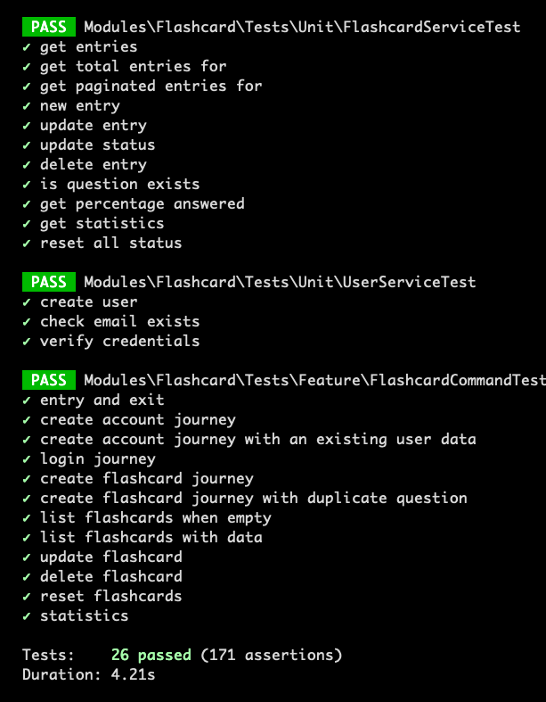

<p align="center"></p>

<p align="center">

</p>

# FLASH CARD

A powerful CLI program for managing your flashcards. It gives you the ability to create, manage and practice flashcards. 

## Prerequisites
- Docker
- PHP (>= 8.2)
- Laravel (>= 11.0)
- Redis
- MySQL
- Nginx
- Composer

## Installation
- Clone the repo
- cd into cloned repo
- `cp .env.example .env`
- Fillup all necessary variables in `.env`
- Pull docker images and run containers `docker-compose up --build -d --wait`
- cd into php container `docker exec -it flashcard_php bash`
- Run `composer install`
- Run `php artisan key:generate`
- Run `php artisan migrate`
- Run CLI `php artisan flashcard:interactive`


## BONUS ADDITIONS
### MYSQL 
A MySQL DB instead of the the default SQLite installation provided by Laravel out of the box. Makes this powerful and production ready, if necessary. 
### DEDICATED TEST DB 
- For Feature/Unit testing, a dedicated MySQL container instead of the traditional in-memory or SQLite DB. It's good to use the same testing engine for both your production and test DB. It encourages consistency.
### PAGINATION
- Ability to paginate the results. This will be fully embraced by users with hundreds or thousands of flashcards, it gives the ability to navigate the program, either during listing, update, create or delete actions. 

<p align="center">

 
 
 
 
 
## TESTING
```
php artisan test
```

## LICENSE
[MIT license](https://opensource.org/licenses/MIT)